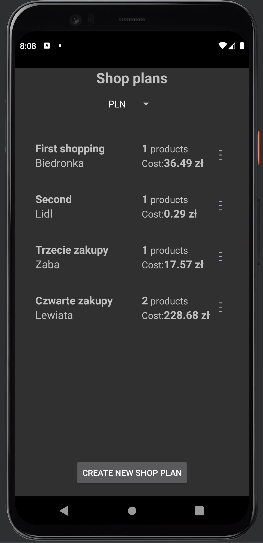
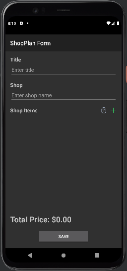
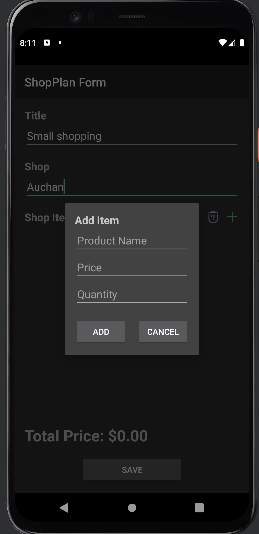
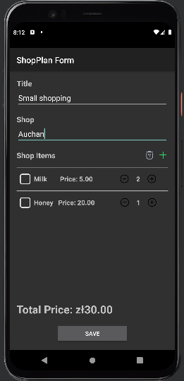
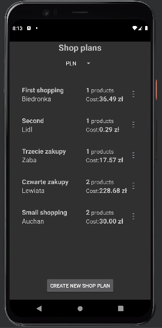
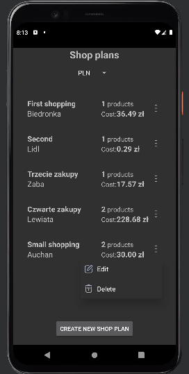

# Shop plan

A simple android app to plan your shopping.

## Table of contents

- [1. Introduction](#1-introduction)
- [2. Features](#2-features)
- [3. Technologies](#3-technologies)
- [4. Screenshots](#4-screenshots)
- [5. Architecture overview](#5-architecture-overview)
  - [5.1. MVVM](#51-mvvm)
    - [5.1.1. Model](#511-model)
    - [5.1.2. View](#512-view)
    - [5.1.3. ViewModel](#513-viewmodel)
  - [5.2. Patterns](#52-patterns)
    - [5.2.1. Singleton](#521-singleton)
    - [5.2.2. Factory](#522-factory)
    - [5.2.3. Observer](#523-observer)

## 1. Introduction

This app is a simple shopping list app. It allows you to create a shopping list and add items to it. You can also remove and edit items. The app also allows you to create multiple shopping lists.
Application is written in Kotlin and uses MVVM architecture. It uses SQLite database to store data. The application uses the Fixer API to get the current exchange rates and convert prices to the selected currency. 

## 2. Features

- Creating shopping lists
- Adding items to shopping lists
- Removing items from shopping lists
- Editing items from shopping lists
- Removing shopping lists
- Converting prices to selected currency

## 3. Technologies

- Kotlin
- MVVM
- SQLite
- Fixer API

## 4. Screenshots

Screenshots of the application.

Shop plan view:

Add shop plan:

Add product:

Added products:

Added shop plans:

Shop plan popup menu:

## 5. Architecture overview

### 5.1. MVVM

#### 5.1.1. Model

The database consists of three tables: shop plans, products, and currencies. The shop plans table contains information about the shop plans, such as the title, shop name, and currency. The products table contains information about the products, such as the name, quantity, and price. The currencies table contains information about the currencies, such as the name and symbol.
Manager classes are used to execute CRUD operations on the database. The ShopPlanManager class is responsible for managing shop plans, the ProductManager class is responsible for managing products, and the CurrencyManager class is responsible for managing currencies.
Data access objects (DAOs) are used to access the database. The ShopPlanDao interface is used to access the shop plans table, the ProductDao interface is used to access the products table, and the CurrencyDao interface is used to access the currencies table.
Repositories are used to manage the data and business logic related to shop plans, products, and currencies. The ShopPlanRepository class is responsible for managing shop plans, the ProductRepository class is responsible for managing products, and the CurrencyRepository class is responsible for managing currencies.

### 5.1.2. View

The ShopPlanActivity class is an Android activity that serves as the main entry point of the application. It extends ComponentActivity and is responsible for initializing the user interface, setting up the ViewModel, and handling user interactions. Some key components of this class include a ShopPlanAdapter for displaying shop plans in a RecyclerView, a ViewModel for managing the data and business logic related to shop plans, and a Spinner for selecting the currency.
The ShopPlanFormActivity class is another Android activity that allows the user to create or update a shop plan. It extends AppCompatActivity and implements the QuantityChangeListener interface. This activity is launched when the user wants to create a new shop plan or edit an existing one. It includes various UI elements such as EditText fields for entering the title and shop name, a RecyclerView for managing the list of products in the shop plan, and buttons for adding, deleting, and saving the shop plan.

#### 5.1.3. ViewModel

The ShopPlanViewModel class is a ViewModel class that acts as a bridge between the data and the UI components. It contains methods for fetching and managing shop plans, as well as handling currency conversions. The ViewModel communicates with the repository classes (ShopPlanRepository and CurrencyRepository) to retrieve and update the data. It also makes use of a third-party API (FixerApiEndPoint) to fetch exchange rates for currency conversion.

### 5.2. Patterns

#### 5.2.1. Singleton

The Singleton pattern is used to ensure that only one instance of the database is created. The Database class is a singleton class that contains a static instance of the database. The getInstance() method is used to get the instance of the database.

#### 5.2.2. Factory

The Factory pattern is used to provide ViewModel instances to the ShopPlanActivity class. The ViewModelFactory class is a factory class that creates instances of the ShopPlanViewModel class.

#### 5.2.3. Observer

The Observer pattern is used to observe changes in the data. The ShopPlanActivity class observes changes in the shop plans and updates the UI accordingly.
